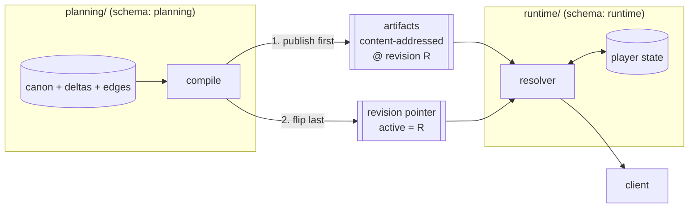

# Architecture — Initial Setup & Target Shape

**Status:** Proposed. This is the buildable form of `proposal.md` — concrete layout,
boundaries, and setup steps. `proposal.md` holds the reasoning; this holds the decisions.

**Scope note.** No table DDL for domain entities (scene, character, look) — those are
settled per-milestone. What is fixed here is the **module layout, the boundaries, the
schema ownership, and the artifact/pointer contract**, because those are expensive to
retrofit and cheap to establish.

---

## 1. Module layout

```
api/
  contracts/           # the only thing both sides may import
    condition/         # condition grammar: type, parser, evaluator
    artifact/          # scene + dialogue artifact schemas, manifest shape
    revision/          # revision pointer format and read/flip interface
    flags/             # flag definition shape (latching vs tracking)

  planning/            # admin-only. LLM-heavy. Writes canon.
    intake/            # scene-shaped and entity-shaped plan proposal
    plan/              # delta lifecycle, approval, versioning
    validate/          # tier 1 shape, tier 2 reference, tier 3 reachability
    edges/             # entity_edges projection
    compile/           # artifact emission, manifest, pointer flip
    canon/             # entity repositories (planning schema)

  runtime/             # player-facing. Read-mostly. No LLM.
    resolve/           # scene resolution, overlay merge, dialogue ladder
    state/             # player state repositories (runtime schema)
    effects/           # effect application, flag setting, stat deltas
    serve/             # HTTP surface
```

**One deployable for now.** Planning and runtime have genuinely different profiles, but two
dockerfiles, two CI pipelines and two config sets are real cost at team-of-one and buy
nothing until traffic or a hard security boundary demands it. The boundary below is what
makes the later split a build-config change rather than a refactor
(`plan-graph-in-postgres.md` §9.4).

## 2. The boundary, and how it is enforced

**Rule:** `planning/` and `runtime/` may not import each other. Both may import
`contracts/`. `contracts/` imports neither.

Enforced by lint, in CI, with a deliberate violation committed as a test fixture during
SC-M1 to prove the rule actually fires. An unenforced architectural rule is a comment.

**`runtime/` dependency budget.** No LLM SDK, no migration tooling, no canon models, no
image pipeline. The premise of the whole architecture is that runtime serves precompiled
artifacts; if its dependency list grows past that, the premise has quietly been abandoned.

## 3. Schema and role ownership

Rung 2 of the separation ladder — same database, separate schemas, separate roles:

| Schema | Owns | Written by | Read by |
|---|---|---|---|
| `planning` | canon entities, `plan_deltas`, `entity_edges`, flag definitions, asset registry | `planning/` | `planning/` |
| `runtime` | player state: flags set, current resolution, pinned cast, progress | `runtime/` | `runtime/` |
| *(existing)* | current `server/` tables, untouched | `server/` | `server/` |

Two DB roles. **The runtime role has no write access to `planning`, and no read access
either.** Runtime gets content exclusively from artifacts, never from canon tables — that
is not a convention, it is a grant.

Per R14, every table declares its writer. A table with two writers is the drift pathology
this redesign exists to remove.

## 4. The planning↔runtime seam

Exactly two things cross:



**An immutable artifact bundle, and a pointer to the active revision.** No shared tables,
no cross-schema foreign keys, no synchronous calls between the two.

Two properties follow structurally rather than by discipline:

- **Publish is atomic and reversible.** Artifacts go up first; the pointer flips last;
  rollback is flipping it back. Old revisions are never mutated.
- **Sessions pin to a revision.** R12's revision-scoping requirement stops being a rule
  to remember and becomes the shape of the system.

## 5. Technology decisions

| Decision | Choice | Rationale |
|---|---|---|
| Primary datastore | **Postgres only** | `plan-graph-in-postgres.md` — overlay, diff, traversal and conflict all reachable; diff and conflict are *better* than the graph equivalent |
| Graph store | **Neo4j stays dark** | Already `NEO4J_ENABLED=false` and tolerated absent. Not removed — removal costs days and buys nothing. Seam kept as `getRelevantCanon(query)` |
| Traversal | **Recursive CTEs over a derived `entity_edges` table** | Materialize the edges and traversal is uniform across heterogeneous entity types. Confirm cost in spike SC-S2 |
| Fuzzy matching | **`pg_trgm`** | Solves alias/duplicate detection, which is the near-term need. Contrib extension, no pipeline |
| Semantic retrieval | **deferred** | Structured filters likely beat embeddings at ~194 entities. `pgvector` only on a measurement showing filters failing |
| Artifact storage | **existing object storage (MinIO/S3) + CDN** | Migration `076` already proved the pattern for dialogue chunks |
| Analytics | **existing Postgres OLAP layer** | Already live: `AdminEventEmitter`, `analyticsQueries.ts`, `LeaderboardWorker`. Emit into it; do not build a parallel emitter |
| Language / typing | **strict TypeScript** | Project convention |

## 6. Cross-cutting invariants

The 14 rules in `lessons-from-current-code.md` §3 apply. The five that shape this
architecture most directly:

| Rule | Architectural consequence |
|---|---|
| **R1** new infra defaults off, correct when absent | Any new dependency ships behind a flag with a defined absent-behaviour |
| **R9** one writer per fact | Enforced by §3's schema/role split, not by review |
| **R10** fail at compile, never fall back silently | The compile step is the gate; runtime fallbacks are explicit ordered chains that emit a signal — **and the signal needs a consumer** |
| **R12** revision-scoped lookups; validate transitions before effects | Structural via §4; `effects/` may not apply an effect it has not validated as reachable |
| **R13** no performance goal without a baseline | The serving benchmark is an SC-M3 deliverable, not an optimization follow-up |

## 7. Initial setup — the concrete steps

Sprint 1 work, in order. Detail and acceptance criteria in `sprint-01.md`.

1. **Create the tree** — `api/{contracts,planning,runtime}` with the subfolders in §1,
   each module a separate tsconfig project so the boundary is a build-level fact.
2. **Wire the lint rule** — no-import between planning and runtime; commit a deliberate
   violation as a fixture; confirm CI fails; remove the violation.
3. **Create schemas and roles** — `planning` and `runtime` schemas, two roles, grants per
   §3. Verify the runtime role cannot read `planning`.
4. **Extend the migration runner** to cover the new schemas, reusing the existing
   migration-log idempotency rather than a parallel mechanism.
5. **Define `contracts/`** — condition grammar type, artifact and manifest schemas,
   revision-pointer interface, flag-definition shape. Types and schemas only; no
   behaviour beyond the condition evaluator.
6. **Add the CI job** — typecheck, lint (including the boundary rule), unit tests across
   all three modules.
7. **Fix D1 and D2** in the current `server/`, with regression tests that fail against the
   old behaviour.

## 8. What is deliberately *not* set up in sprint 1

Building these before the spikes answer is how a solo dev spends a sprint on the wrong
abstraction:

- No `entity_edges` table — its shape depends on SC-S1/SC-S2 outcomes.
- No scene entity — SC-M2, after the condition grammar is real.
- No artifact compile step — SC-M2, after there is a scene to compile.
- No intake changes — SC-M4. The existing `FILL_TARGETS` path keeps running untouched.
- No asset or activity tables — SC-M6, and the activity/asset review answers still have
  four open decisions (`brief-activity-and-assets.md` §6 review notes).

## 9. Open architectural decisions

Carried from `proposal.md` §8 and the activity/assets review. Each has a milestone by
which it must be settled.

| # | Decision | Settle by |
|---|---|---|
| A1 | File-canonical (YAML) vs. DB-canonical content — and whether existing content is imported or ages out | SC-M4 |
| A2 | Scene pinning: per visit, per time-block, or re-resolve every entry | SC-M3 |
| A3 | Precedence rule for exclusive scene properties on overlay conflict — and whether equal priority warns or fails | SC-M2 |
| A4 | Approval granularity: whole-plan or partial | SC-M4 |
| A5 | Regeneration vs. hand-edit merge rule | SC-M4 |
| A6 | ~~Weather source — where the live value comes from~~ — **resolved**: `districts.weather` (default) + `scene.weather` (author override, wins when set), resolved by the caller before `buildBackgroundHints` (`spikes/SC-S5-weather-source.md`) | SC-M2 |
| A7 | `asset_fallback` signal consumer | SC-M6 |
| A8 | Whether `dialogue_bias` and `look_hint` survive R7 (no field without a reader) | SC-M6 |

A3 has a recommendation already: **equal priority on an exclusive property should fail the
compile**, because equal priority means nondeterminism and a warning on nondeterminism is
a bug that ships.
