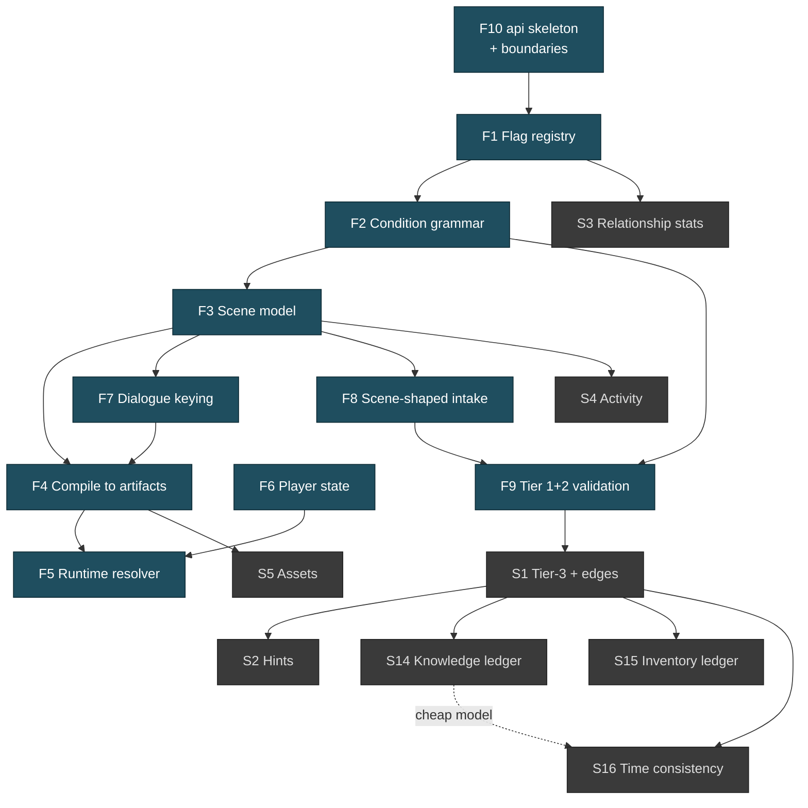

# Features — Priority & Dependencies

**Status:** Living document. Revised at every sprint retro (see `roadmap.md` §5).

**Priority test.** A feature is **primary** if the first playable vertical slice cannot
exist without it, *or* if it blocks something that is primary. Everything else is
**secondary** — valuable, but the slice ships without it.

The vertical slice this is measured against (`proposal.md` §7): *one scene at one
location, containing one named character with one personality pool and one scene-keyed
line, one flag set by it, gated selection between that scene and a "normal day" base
scene, authored through scene-shaped intake with shape and reference checks live,
compiled to an artifact, and served by the new resolver with revision-scoped cache keys
and choice-reachability validation.*

---

## 1. Primary features

| ID | Feature | Why primary | Milestone |
|---|---|---|---|
| **F1** | **Flag registry** — flags as first-class authored objects with latching/tracking declared | Everything gates on flags. Without a registry, typos are undetectable and tier-3 checking is impossible | SC-M1 |
| **F2** | **Condition grammar** — one expression language, four consumers (scene selection, dialogue availability, item unlock, mission win) | Four grammars means four validators and no cross-cutting "is this flag ever set?" query | SC-M1 |
| **F3** | **Scene model** — scene entity, base + overlay composition, exclusive vs. additive property resolution, priority precedence | The unit. Everything else composes around it | SC-M2 |
| **F4** | **Compile to artifacts** — immutable content-addressed scene/dialogue artifacts + atomic revision pointer flip | The serving model, and the seam between planning and runtime | SC-M2 |
| **F5** | **Runtime resolver** — revision-scoped lookup, condition evaluation against player state, choice-reachability validation before effects | Serves the slice. Contains the fix for two live correctness bugs | SC-M3 |
| **F6** | **Player state** — flags set, current scene resolution, pinned cast, progress | Runtime's only database. Conditions evaluate against it | SC-M3 |
| **F7** | **Dialogue three-way keying** — personality (shared) / relationship (named) / scene (role-slot), resolved by specificity ladder | The content model. Personality pools are also the mob machinery | SC-M2 |
| **F8** | **Scene-shaped intake** — writer describes a situation, plan proposes a scene with participants, activity, dialogue and flags as one delta set | The feature that fixes 194 characters / 7 speakers / 1 mission | SC-M4 |
| **F9** | **Tier 1+2 validation** — shape checks (per-tier required fields) and reference checks (does the target exist), running at plan time | Errors must reach the writer while the plan is still editable | SC-M4 |
| **F10** | **`api/` skeleton + boundaries** — three modules, lint-enforced no-import between planning and runtime, separate DB schemas and roles | Cheap upfront, expensive to retrofit. Makes the later deployable split a config change | SC-M1 |

## 2. Secondary features

| ID | Feature | Why deferrable | Earliest |
|---|---|---|---|
| **S1** | **Tier-3 validation** — `entity_edges` projection, reachability, orphan flags, dead ends | The slice is small enough to verify by hand; the value scales with content | SC-M5 |
| **S2** | **Hint engine** — statistical "characters in this role usually also have X" | Needs tier-3 plus enough content for "usually" to mean anything | SC-M5 |
| **S3** | **Relationship stats + threshold→flag emission** | Orthogonal by design (`proposal.md` §3). Flags alone carry the slice | SC-M6 |
| **S4** | **Activity** — catalog of verbs + role-slot binding | Slice works with `NULL` (idle). First increment is 4 verbs, `completion.type='none'` | SC-M6 |
| **S5** | **Asset look/expression model + mob pool** | Slice needs one portrait. The model matters at content volume | SC-M6 |
| **S6** | **Character tier enforcement** | Tiers are declared in F9's shape checks; *enforcement* against assets needs S5 | SC-M6 |
| **S7** | **Missions** — ordered scene collection + win condition | Needs F2 and F3 first; a mission is a composition of things that must exist | post-M6 |
| **S8** | **Items** — objects given on unlock condition | Same grammar as F2, no new machinery. Pure content feature | post-M6 |
| **S9** | **Casting by description** — participant slots cast or spawn from a description | Makes scene authoring fast; scene authoring works without it | post-M6 |
| **S10** | **`pg_trgm` alias detection** — "did you mean `central-market`?" | A tier-2 quality improvement, not a tier-2 prerequisite | SC-M5 |
| **S11** | **Lazy asset generation** — plan approval enqueues generation for newly required looks | Ship with hand-picked assets first | post-M6 |
| **S12** | **Interactive activity + `activity_sets_flag`** | Needs F1 flag plumbing and a real minigame to return into | post-M6 |
| **S13** | **Content import from existing YAML** | Open question #8 — may be "let it age out" instead | undecided |
| **S14** | **Metagame / character-knowledge consistency** — per-character knowledge ledger (`knows_fact` edges: `fact_id`, `source_scene`, `acquired_via`, `story_beat`) + authoring-time checker that flags any dialogue/overlay line where an NPC references a fact not in their ledger at that beat (covers "said in their head / wasn't there" cases) | Same tier-3 family as S1. Needs `entity_edges` + scene model + `LLM_MODEL` cheap-checker / `LLM_DEEP_MODEL` writer pattern (`LiteLLMProvider.ts` two-model split). Slice is playable without it; value scales with authored secrets | SC-M5 (ledger shape) → SC-M6 (checker) |
| **S15** | **Inventory possession ledger + consistency checker** — per-character/per-location possession state (`has_item` / `item_at_location` edges) + checker that flags giving/using an item never acquired, or still carrying an item marked lost/consumed | Extends S8 (Items) with ledger semantics. Uses same condition grammar (`F2`) and `entity_edges` projection as S1. Slice works without items; checker only matters once items exist | SC-M6 (ledger shape with S8) → SC-M6 (checker) |
| **S16** | **Time-block / narrative-elapsed consistency checker** — validates `time_block_cost` declarations against narrative prose claims ("three hours passed") and against `timeBlocks` clock (`client/src/utils/time.ts`, `PhoneStore.ts`). Flags prose/time-cost mismatches and scene sequences whose declared TB span contradicts achievable elapsed time | Authoring-time analogue of runtime `time_blocks` enforcement. Needs `F3` scene time + `F2` grammar. No new runtime machinery; purely deterministic lint over plan deltas | SC-M5 (deterministic cost linter) → SC-M6 (prose-vs-cost LLM assist via cheap model) |

## 3. Dependency graph

**The critical path is `F10 → F1 → F2 → F3 → F7 → F4 → F5`, with `F6` required before F5.**
The graph already requires F7 before F4 (dialogue keying is an input to compile) and F6
before F5 (resolver needs player state). Everything else is parallel or later.

## 4. Explicitly out of scope

Not deferred — **not planned**, unless something changes:

| Not doing | Why |
|---|---|
| Neo4j removal | Already `NEO4J_ENABLED=false` by default and tolerated absent. Removal costs days and buys nothing (`plan-graph-in-postgres.md` §8) |
| `pgvector` | Structured filters likely beat embeddings at ~194 entities. Revisit only on a measurement showing filters failing (§6 of the same doc) |
| A columnar analytics store | The OLAP workload already exists in Postgres and works (§9.6) |
| Structuring `personality` into archetypes | Zero runtime readers; its only consumer is an LLM reading prose. Violates R7 |
| Mob/crowd simulation | Personality pools shared across mobs already deliver "populated" at near-zero cost |
| Separate planning/runtime deployables | Rung 4 of §9.4. Nothing forces it yet; the seam keeps it a config change |
| Rewriting the existing asset generation pipeline | It works. F-track only changes where its output is *recorded* |

**Scheduled, not out of scope:** rung-3 physical separation (dedicated
`postgres-planning` / `postgres-runtime` + per-DB migration folders) and legacy
DB archive/delete are planned as SC-M7 (`SC-E11` + `SC-905–SC-908`). Rung 2
(shared-DB schemas + roles) is the stepping stone, not the destination.

## 5. Two live bugs, tracked outside this feature set

These are defects in the **current** `server/`, not features of the new backend. They are
scheduled first because they are player-facing and because fixing them informs F5's
design.

| ID | Defect | Evidence |
|---|---|---|
| **D1** | Chunk lookup not scoped to the player's active content revision (`WHERE chunk_key = $1 LIMIT 1`) | flagged independently by internal and external review |
| **D2** | Submitted choice not validated as reachable from the player's current node before effects apply | same |

## 6. Known prerequisite gaps

Discovered during review; each blocks a feature and none has an owner yet.

| Gap | Blocks | Detail |
|---|---|---|
| **Weather has no live source** | F3 (exclusive properties), S5 | `buildBackgroundHints(timeOfDay, weather?, mood?)` accepts weather, but `AGENTS.md:36` states it is "a forward-compatible hook with no live source yet (callers pass `undefined`)" |
| **No dialogue serving benchmark** | F5 | Nothing in the repo measures chunk fetch or portrait load. R13 forbids a performance goal without a baseline |
| **`asset_fallback` signal has no consumer** | S5 | A signal nobody reads is why expressions went dark. Needs at minimum a compile-time coverage report |
| **File-canonical vs. DB-canonical undecided** | F8, S13 | Open question #8. The external reviewer never engaged it because the brief underplayed it |
| **Knowledge-ledger shape** | S14 | No `knows_fact` projection exists yet; needs SC-S8 spike to decide `fact_id` granularity (secret vs. per-utterance) and whether facts are authored explicitly or inferred via LLM cheap-checker |
| **Inventory-ledger shape** | S15 | `has_item` edges not yet projected; needs SC-S9 spike to decide per-character vs. per-location possession and consumption semantics |
| **Time-vs-prose checker calibration** | S16 | Deterministic TB-sum check is trivial; LLM-assist "prose claims 3 hours" detection needs SC-S10 spike to measure cheap-model precision/recall |
