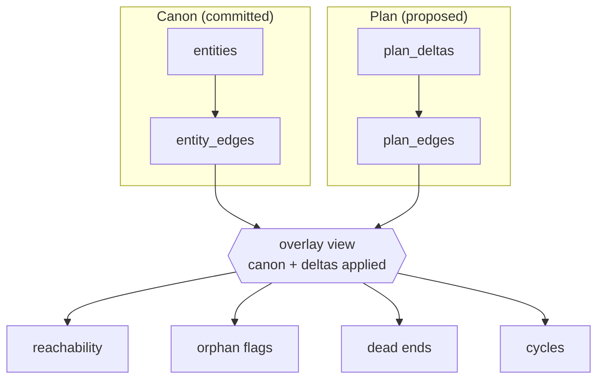
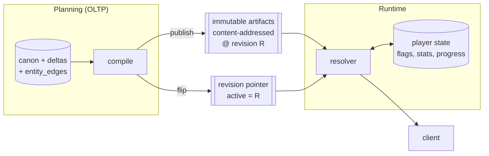

# Plan Graph in Postgres — Can We Drop Neo4j Without Losing Anything?

**Status:** Exploration. Companion to `proposal.md`. Question raised by the external
reviewer and worth resolving properly rather than by preference.

**The question:** Neo4j currently sits in the authoring path as a disposable IR. It gives
us plan-vs-canon diffing, conflict checks, and graph-shaped reasoning before commit. If
Postgres can give the same capabilities — with `pg_trgm`/`pgvector` for similarity — then
the new backend should not carry a second datastore. What schema would that take, and
what, precisely, would we lose?

---

## 1. What Neo4j actually provides today

Per `docs/GRAPH_AUTHORING_ARCHITECTURE.md`:

- Canon content seeds as `(:Content)` nodes.
- A plan's changes become `ADD` / `MODIFY` / `DELETE` deltas tagged with `plan_id`.
- Those deltas support reasoning and critique **before** anything is committed.
- Flow: `plan deltas → GraphMerger → GraphExporter → ContentPlan → stagePlan → applyLink → migrateContent → verifyPlan`.
- Postgres remains the durable source of truth throughout; `critique_annotations` is the
  durable critique record.
- `NEO4J_ENABLED` defaults to `false` (`.env.example:18`, `docker-compose.yml:157`) and
  the server must tolerate its absence.

So four capabilities are actually in use:

| # | Capability | Why it matters |
|---|---|---|
| C1 | **Overlay** — view canon *as if* a plan were applied, without committing | the whole point of a reviewable plan |
| C2 | **Diff** — what this plan changes, renderable | writer review UI |
| C3 | **Traversal** — reachability, orphans, dead ends, cycles | tier-3 checking (`proposal.md` §4.2) |
| C4 | **Conflict detection** — two plans touching the same thing | concurrent authoring safety |

Similarity/retrieval (C5) is a *fifth* need the graph never served — it was going to be
handled separately.

---

## 2. The reframe: the hard part is overlay, not traversal

Graph databases are chosen for traversal. But **traversal is the easy capability here**,
and overlay is the hard one — and Neo4j does not solve overlay natively either. The
`plan_id`-tagged delta scheme was *built on top* of Neo4j, not provided by it.

That is the crux: the mechanism doing the real work (tag deltas, merge, project) is
datastore-agnostic. It was implemented in Cypher; it could equally be implemented in SQL.
And the traversals actually needed are shallow and bounded.

That reframing is what makes the migration plausible rather than wishful.

---

## 3. Proposed Postgres shape

Three ideas, in order of importance.

### 3.1 An entity-agnostic delta layer

One delta table for all entity types, rather than a delta table per type:

```
plan_deltas
  plan_id          -> content_plans
  entity_type      'character' | 'scene' | 'location' | 'flag' | 'item' | ...
  entity_slug      stable identity, assigned at proposal time
  op               'ADD' | 'MODIFY' | 'DELETE'
  payload          jsonb   -- full for ADD, changed fields only for MODIFY, null for DELETE
  base_hash        content hash of canon at authoring time (null for ADD)
  position         ordering within the plan
  UNIQUE (plan_id, entity_type, entity_slug)
```

This is the piece that makes it graph-*like*: the delta layer does not know what an
entity is, so adding scenes, items, flags, and activities later requires **no new delta
machinery**. It is the same generality `(:Content)` nodes gave, expressed as rows.

`base_hash` is a bonus Neo4j did not provide: optimistic concurrency. If canon's hash
moved since the delta was authored, the delta is stale and can be flagged rather than
silently applied over someone else's change.

### 3.2 A derived edge table — this is the actual replacement for the graph

**You do not need a graph database. You need an edge table.**

```
entity_edges
  from_type, from_slug
  edge_kind      'scene_participant' | 'sets_flag' | 'requires_flag' | 'located_in'
                 | 'gives_item' | 'mission_scene' | 'affiliated_with' | ...
  to_type,   to_slug
  attrs          jsonb    -- role slot, priority, condition fragment
  -- derived at compile time from entity payloads; never hand-authored
```

Edges are **projected** from entity payloads, not authored. That is what buys uniform
traversal across heterogeneous types: instead of "join scenes to participants to
characters to items," every tier-3 query traverses one indexed table. This recovers the
ergonomic win of Cypher — heterogeneous traversal without a bespoke join per question.

The same projection runs over plan deltas to produce `plan_edges`, so the overlay
composes:



### 3.3 The overlay as a view, not a materialization

"Canon as if this plan applied" is a composition, expressible as a view or CTE
parameterized by `plan_id`: canon `LEFT JOIN` deltas, with `DELETE` rows filtered out and
`MODIFY` payloads merged over the canon row. **Note:** naive `jsonb` merge (the `||`
operator) is insufficient for entity payloads with array-shaped fields (most types have
them); per `spikes/SC-S3-overlay-view.md`, a wholesale array replacement silently produces
wrong reachability answers. Array-aware merge logic (per-element by id, not wholesale
replacement) is required; see open question #3.

That is exactly what `GraphMerger` does — in SQL, inside the same transaction as canon,
with no second store to keep in sync — once the merge strategy is specified.

---

## 4. Capability-by-capability

| | Neo4j today | Postgres equivalent | Assessment |
|---|---|---|---|
| **C1 Overlay** | `plan_id`-tagged subgraph merged by `GraphMerger` | overlay view: canon `LEFT JOIN plan_deltas`, `jsonb` merge for MODIFY | **equal**, and transactional with canon |
| **C2 Diff** | computed by comparing tagged subgraphs | **the delta rows *are* the diff** — no computation | **better**: directly queryable and renderable |
| **C3 Traversal** | Cypher | recursive CTE over `entity_edges` | **equal at this scale** — see §5 |
| **C4 Conflict** | node-level comparison across plans | `UNIQUE (plan_id, type, slug)` + `base_hash` staleness check + cross-plan overlap query | **better**: constraints make some conflicts unrepresentable |
| **C5 Similarity** | not provided | `pg_trgm` now, `pgvector` if needed | **new capability**, see §6 |

---

## 5. Are the traversals actually within reach of recursive CTEs?

The tier-3 checks from `proposal.md` §4.2, honestly assessed:

| Check | Shape | Verdict |
|---|---|---|
| Flag set but never read (**orphan**) | anti-join on `edge_kind IN ('sets_flag','requires_flag')` | not even traversal — trivial |
| Flag required but never set (**dead end**) | anti-join, reverse direction | trivial |
| Scene no condition can ever select | anti-join on reachable flag set | trivial once reachability exists |
| Item nobody gives / character in no scene | anti-join | trivial |
| **Reachability** from game start | recursive CTE over `sets_flag` / `requires_flag` edges | standard; bounded by content size |
| **Cycles** | recursive CTE with a visited-path array | standard idiom |
| "X knows Y but never met Z" | 2–3 hop self-join | plain SQL |

Content volume is a few hundred nodes today and a few thousand plausibly. Recursive CTEs
over an indexed edge table are milliseconds at that scale.

**Where recursive CTEs genuinely get awkward:** variable-length paths with complex
per-hop predicates, shortest-path, and centrality/clustering analytics. **None of those
appear in the tier-3 list.** If they ever do, that is the honest trigger to reconsider —
see §8.

---

## 6. Similarity — a graduated answer, not "add pgvector"

The reviewer proposed pgvector. That is right for one need and overkill for the nearer
one. Two different problems get conflated:

**Problem A — duplicate/alias detection.** "The writer typed *el mercado de la ciudad*;
we already have *central-market*." This is **fuzzy string matching on names and aliases**,
not semantic similarity. `pg_trgm` (a standard contrib extension, ships with Postgres)
solves it with a trigram index and a similarity threshold. No embedding pipeline, no
reindex-on-edit, no model dependency. This is the near-term need and it is cheap.

**⚠ Caveat (SC-S4 spike, 2026-09-08):** The motivating example above—*el mercado de la
ciudad* vs. *central-market*—is **not** actually solvable by `pg_trgm`. Trigram similarity
measures shared 3-character substrings; pure translations (no shared substring) score 0.0
and are unrecoverable at any threshold. `pg_trgm` does catch: accent/case variants
(`Plaza de la Constitucion` ↔ `Plaza de la Constitución`), truncations/substrings,
partial-word matches, and some reorderings. Pure translations, slang synonyms, and acronyms
require the existing `entity_aliases` table (which is already populated for characters,
scenes, missions, dialogues; and planned for locations as part of SC-103). SC-706's spec
should call out this limitation explicitly: `pg_trgm` is a *supplement* for catching
typos/variants, not a complete alias system.

**Problem B — semantic retrieval for the Scene Card.** "Pull the entities thematically
relevant to this scene description." This is genuinely semantic and is what `pgvector`
is for.

But note the scale: at ~194 characters and a few dozen locations, **structured filtering
probably beats embedding retrieval** — filter by district, `social_role`, tier, and
mission involvement, order by recency. The corpus is small and well-structured, which is
the regime where filters win. `pgvector` earns its place when structured filters
demonstrably return the wrong entities, which is a measurable condition, not a
guess.

**Recommended order:** `pg_trgm` immediately (it directly powers a tier-2 check).
Structured filters for Scene Card retrieval. `pgvector` only when a measurement shows
filters failing.

---

## 7. What Postgres gives that Neo4j structurally cannot

- **One ACID boundary.** Deltas and canon commit in the same transaction. The reason the
  graph had to be "disposable" and default-off is precisely that two stores can drift —
  a fragility that disappears rather than being managed.
- **Constraints make invalid states unrepresentable.** FKs, `CHECK`, unique indexes,
  exclusion constraints. Neo4j has almost no constraint story; every invariant there is
  application-enforced. Given tier-1/tier-2 checking is *entirely* about invariants, this
  is a substantial advantage.
- **The diff is data, not a computation.** Delta rows render directly into a review UI.
- **One backup, one migration story, one pool, one credential set, one dependency.** At
  team-of-one this is the dominant cost term.
- **Every existing investment applies** — migration tooling, test harness, connection
  handling, admin endpoints.

## 8. What is genuinely lost

- **Cypher's exploratory expressiveness.** Ad-hoc "what does this look like" queries are
  more pleasant in Cypher. Mitigation: named SQL functions per tier-3 check, which you
  want anyway since they must run in CI.
- **Deep/variable-length path queries** stay awkward. Not currently needed.
- **Graph visualization** feels native to a graph store — but the UI reads rows and
  renders nodes/edges either way, and `entity_edges` is already exactly that shape.

**Honest trigger conditions to revisit Neo4j:** shortest-path or centrality analytics
become a product feature; traversals routinely exceed ~5 hops with per-hop predicates; or
content grows past the point where recursive CTEs over `entity_edges` stop being
milliseconds. Keep the seam (`getRelevantCanon(query)` from `proposal.md` §4.2) so
reintroduction stays an implementation swap.

---

## 9. Workload separation: planning OLTP vs. runtime serving

The structure that falls out is CQRS-shaped — a write model (canon + `plan_deltas`,
normalized and constrained) and read models (`entity_edges` for analysis, compiled
artifacts for serving) that are **always rebuildable from the write model**. That
rebuildability is what makes them safe to change without a migration, and it is the same
property that made the Neo4j graph disposable — now retained without a second datastore.

But "planning OLTP, runtime OLAP + CDN" is one workload short and one label wrong. Worth
getting precise, because the correction simplifies the architecture rather than
complicating it.

### 9.1 There are three workloads, not two

| | Planning | Serving | Analytics |
|---|---|---|---|
| **Shape** | OLTP — normalized, constrained, transactional | **key-value artifact lookup** | OLAP — columnar, aggregate |
| **Data** | canon entities, deltas, edges, flags | immutable compiled artifacts + player state | player events, telemetry |
| **Traffic** | admin-only, low volume | player-facing, high fan-out | batch |
| **Priority** | correctness | latency | throughput |
| **Exists today?** | yes | partially | **yes — see §9.6** |

**Runtime is not OLAP.** The player asks "which scene resolves at this location given
these flags," which is a *lookup* against a precomputed artifact — not an aggregation.
Calling it OLAP would push toward columnar storage that serves no purpose here.

True OLAP is a **third** workload: which paths players take, where they drop off, which
scenes are never seen. That is player telemetry — different data, not a view over canon —
and it does not exist yet.

### 9.2 The runtime database is a player-state database

This is the consequence worth internalising: **content leaves the database at compile
time.** Migration `076` already proved the pattern by dropping `nodes`/`leaves` JSONB and
serving chunks from object storage.

So runtime's Postgres footprint is not content at all. It is:

- current location, active scene resolution, and pinned cast
- flags set
- relationship stats
- mission progress
- save/session state

That is small, per-player, transactional — **OLTP again, just a different OLTP**. Runtime
never queries canon, never joins entities, never traverses edges. It resolves a condition
against player state and fetches an artifact.

### 9.3 The interface between them is two things



**An immutable artifact bundle, and a pointer to the active revision.** That is the entire
coupling. No shared tables, no foreign keys across the seam, no synchronous calls.

Two properties fall out for free:

- **Player sessions pin to a revision.** This is exactly the revision-scoping requirement
  from `lessons-from-current-code.md` R12 — it stops being a discipline you have to
  remember and becomes the shape of the system.
- **Publishing is atomic and reversible.** Artifacts go up first; the pointer flips last.
  Rollback is flipping it back, because old revisions are never mutated.

### 9.4 Physical separation: escalate only when something forces it

Four rungs, cheapest first:

| Rung | Separation | Escalate when |
|---|---|---|
| 1 | Same database, same schema, lint-enforced no-import between modules | *start here* |
| 2 | Same database, separate schemas (`planning.*`, `runtime.*`), separate DB roles | you want the credential boundary — runtime shouldn't be able to write canon |
| 3 | Separate databases, same instance | backup/restore cadences genuinely differ |
| 4 | Separate instances | runtime traffic contends with planning, or the security boundary must be physical |

Because §9.3's seam is a file bundle plus a pointer, **every rung is reachable without a
schema change** — the escalation is configuration, not refactor. Rung 2 is cheap and
worth taking early: a runtime role with no write access to canon makes an entire class of
mistake impossible.

At team-of-one, rungs 3 and 4 buy nothing until there is player traffic to protect.

### 9.5 Where "OLAP-ish" legitimately appears — on the planning side

The tier-3 checks (`proposal.md` §4.2) are the closest thing to analytical queries in the
system: whole-graph anti-joins and recursive traversals. If they get slow, the answer is
**materialized views refreshed on plan validation**, not a columnar store. Content volume
is a few hundred rows; a refresh is milliseconds.

This is worth naming because it is where the instinct to reach for OLAP will come from,
and materialized views in the same database satisfy it with no new infrastructure.

### 9.6 The analytics workload already exists — interoperate, don't invent

**Correction to an earlier draft of this section, which claimed analytics was
hypothetical. It is not.** `AGENTS.md` carries a dedicated "OLAP and leaderboard rules"
section, and the implementation is live:

- Events are emitted from runtime paths — `dialogue-choose.ts`, `gigs.ts`,
  `comms-*-helpers.ts`, `player-helpers.ts` — via `AdminEventEmitter.ts`.
- `server/src/routes/utils/analyticsQueries.ts` holds the aggregate queries.
- `server/src/workers/LeaderboardWorker.ts` consumes them, with
  `OLAP_GRACE_PERIOD_MINUTES = 2` to absorb OLTP→OLAP timing skew.
- There is **no separate columnar store** — OLAP here means analytics-shaped queries
  against Postgres.

So the third workload is real, in production, and Postgres-resident. Three consequences
for the new backend:

1. **The new runtime must keep emitting into the existing event stream.** This is not a
   greenfield decision; scene-entered / choice-taken / flag-set events join an established
   telemetry contract. Check `AdminEventEmitter` before inventing a parallel emitter.
2. **The documented OLTP↔OLAP timing coupling is a real constraint.** The 2-minute grace
   period exists because a worker reading telemetry after an OLTP deadline can otherwise
   race. `AGENTS.md` also warns that a no-filter probe returning the expected `tb_spent`
   while the worker returns `0` means suspect seed timing before touching worker logic.
   Any new event the runtime emits inherits that hazard.
3. **Half the analytics value still needs no player data at all.** "Which scenes are
   unreachable, which dialogue can never fire, which items nobody gives" are tier-3
   queries against the planning database. Content-coverage analytics comes free with work
   already proposed; only *behavioural* analytics needs telemetry.

A separate columnar store remains unwarranted. If it ever arrives it is fed by the
existing event stream — never a view over canon, and never a reason to add columnar
storage to the planning database.

### 9.7 Consequence for the `api/` structure

This validates and sharpens `proposal.md` §6. The `planning/` ↔ `runtime/` no-import rule
is not stylistic — the two modules genuinely share **no tables**. `contracts/` holds the
artifact schema, the condition grammar, and the revision-pointer format, which is the
complete surface between them.

It also means `runtime/`'s dependency surface should stay deliberately small: no LLM SDK,
no migration tooling, no canon models. If that discipline holds, splitting runtime into
its own deployable later is a build-config change, and the version after that could be
mostly CDN plus a thin resolver.

The repo has a `/cqrs` skill and clean-code ADRs; this should be checked against them
rather than reinventing the vocabulary.

---

## 10. What to prototype before committing

Small and decisive, in order:

1. **Project `entity_edges` from existing content** (~194 characters, 59 dialogue files,
   1 mission). Measure the row count and index size. If the projection is awkward for
   current data, the whole idea is weaker than it looks — find that out first. See
   `spikes/SC-S1-entity-edges-projection.md` for the actual result: 1,018 rows, 96% of
   edges project cleanly; `mission_scene` requires a schema change per SC-700.
2. **Write the four cheap tier-3 anti-joins** (orphan flag, dead end, unreachable scene,
   unreferenced item) against that table and run them on real content. They should find
   real problems immediately; if they find nothing, the current content is either clean or
   the projection is wrong.
3. **One recursive-CTE reachability query** with `EXPLAIN ANALYZE`. Record the number.
   This is the only performance claim in the whole document that needs evidence.
4. **The overlay view** for one hand-written plan with an `ADD` and a `MODIFY`, and confirm
   the traversals produce different answers with and without it applied.
5. **`pg_trgm` alias detection** on existing location and character names — see whether it
   catches known duplicate phrasings.

If steps 1–4 hold, Neo4j has no remaining role and the new backend carries one datastore.

---

## 11. Open questions

| # | Question |
|---|---|
| 1 | Is `entity_edges` derived at plan-validate time, at migrate time, or both (canon vs. overlay)? |
| 2 | Does the edge projection live in SQL (generated columns / triggers) or in application code? Triggers keep it consistent; app code keeps it debuggable. |
| 3 | `MODIFY` payload — changed fields only, or full snapshot? Changed-fields is a smaller diff; full snapshot is easier to validate in isolation. **Answered by `spikes/SC-S3-overlay-view.md`: changed-fields-only with naive merge fails on array fields (silently produces wrong answers). Must be either full-snapshot, or changed-fields with array-aware per-element merge.** |
| 4 | Does a `DELETE` delta cascade in the overlay (deleting a scene hides its edges), and how are resulting orphans reported vs. suppressed? |
| 5 | Is `entity_slug` assigned by the LLM at proposal time, and how are collisions with canon resolved before approval? |
| 6 | How does this interact with `graph_revision` (migration `089`), which currently bumps only on amendment commits? |

---

## 12. References

- `docs/GRAPH_AUTHORING_ARCHITECTURE.md` — current Neo4j role and the merge/export flow
- `server/src/database/migrations/089_content_plans_graph_revision.sql` — monotonic
  revision counter, bumps only on amendment commits
- `docs/feat/scene-centric-backend/proposal.md` §4.2 — the three checking tiers this must serve
- `docs/feat/scene-centric-backend/lessons-from-current-code.md` — patterns to keep and avoid
