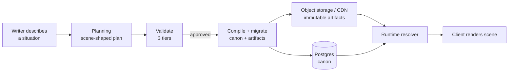
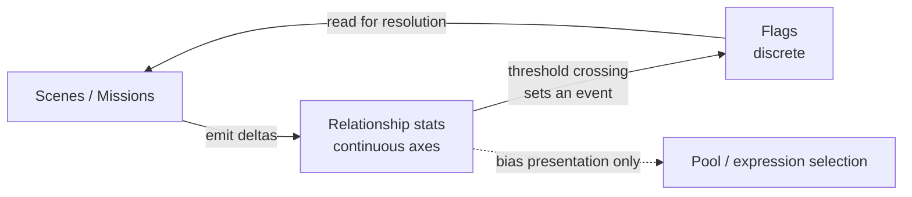

# Scene-Centric Backend — Proposal

**Status:** Proposal. Supersedes the direction in `docs/CHARACTER_DATA_MODEL.md`
(character-schema-first) and incorporates `docs/feat/character-data-model-and-intake/strategy.md`
(internal critique) plus an external independent review.

**What this proposes:** a new backend — planning, compilation/migration, and runtime —
built around the **scene** as the unit of composition, rather than the character. Built
in a new tree alongside the existing `server/`, `scripts/`, and `content/`, which keep
working until the new path reaches parity and the old code can be deleted.

**Deliberately not in scope:** table DDL. Entities and their relationships are named
and their responsibilities fixed; exact column shapes are left open so an independent
reviewer can still propose structure. Two subsystems (**activity**, **assets**) are
marked open and need their own pass.

---

## 1. Thesis

One unit appears in all three phases, and it is not the character:

| Phase | Unit today | Unit proposed |
|---|---|---|
| Planning | entity (character, location, dialogue as separate items) | **scene** |
| Compilation | dialogue tree | **scene** |
| Runtime | dialogue tree walked node-by-node | **scene** |

The evidence that the current unit is wrong is in the content distribution: **194
characters, 7 of them able to speak, 1 mission.** That is not a discipline failure — the
intake pipeline optimizes for complete entities (`FILL_TARGETS` asks the LLM for 17–21
metadata fields per character), and a complete entity is not playable. A character with
21 filled fields and no scene to stand in is inventory, not game.

Scene-shaped intake produces playable content by construction. The same writer
description — *"a car accident in Centro, a panicked driver, a bystander who saw
everything"* — yields a playable scene under the proposed model, and two character
records plus a lore stub under the current one.

The structural payoff: if the authoring unit, the LLM generation context, and the
runtime row are all the scene, they become three lifecycle stages of one object with no
translation layer between them. That removes an entire class of drift, including the
kind that produced the current three-way portrait registry disagreement.



---

## 2. Runtime model

### 2.1 Spatial hierarchy

**Map → districts → locations → scenes.** Districts are bounded by natural features
(river, mountains) and carry ambient state. Locations sit inside districts. Scenes are
resolved *at* a location.

### 2.2 Scenes compose; they do not replace

A location may host **more than one active scene at once** — "the street is fine, but
there is a dangerous man standing there." So scene properties divide by arity:

| Kind | Properties | Resolution |
|---|---|---|
| **Exclusive** | background, weather | exactly one wins — needs explicit precedence |
| **Additive** | participants, items, activities, dialogue | all active scenes contribute |

Model this as **base scene + overlays, ordered by priority.** Precedence only needs
resolving for exclusive properties. **Overlay merge semantics (schema-owned):** higher
`priority` wins for exclusive scalars (background, weather — last write wins in priority
order); additive collections (participants, items, activities, dialogue refs) are **merged,
not replaced** — elements are matched by stable id (`slot_id`, `item_slug`, `activity_slug`,
choice `id`/dialogue `node_id`) and merged per-field, ordered by priority then by schema
definition order; an overlay deletes only what its `DELETE` delta explicitly names (no
wholesale array replacement — naive `jsonb ||` is incorrect for array fields per
`spikes/SC-S3-overlay-view.md`). Whether the merged collection's final order is
priority-order or schema-order is owned by the entity's schema definition in
`contracts/`.

> **Existing precedent:** `content/overlays/` already does exactly this at the dialogue
> level — an overlay injects nodes into a base tree, gated by `mission_id`, ordered by an
> explicit `priority` field. This generalizes that pattern from trees to scenes rather
> than inventing it.

**Open:** whether a resolved scene **pins** for a visit / time-block or re-resolves on
every entry. Re-resolving risks a scene flickering between visits; pinning needs save
state. The casting precedent (pin at the point of no return) suggests pinning.

### 2.3 Weather: inherit with deliberate override

Weather defaults from district/world state. A scene **may** override it as an *authored
intent* — localized rain next to sunshine is a legitimate emotional tool. Because an
override is something a writer typed on purpose, accidental incoherence still cannot
occur.

### 2.4 Character tiers are budget declarations

Not personality categories — they tell the validator what to require and the asset
pipeline what to generate.

| Tier | Unique dialogue | Unique assets | Linked items | Relationships |
|---|---|---|---|---|
| **named** | yes | yes | yes | **yes** |
| **cameo** | yes | yes | yes | no |
| **mob** | no (shared pool) | no (shared) | no | no |

Two independent axes, not one ladder: *does it get relationship dialogue* (named only)
and *does it get unique content* (named + cameo).

**Promotion must be a supported operation, not a migration.** Writers will fall for a
cameo and want to give it an arc; promoting should mean "generate the missing pieces."

### 2.5 The scene's reach into a character — an invariant

> A scene may override a character's **presentation and behavior** — place, activity,
> look, dialogue pool. It may **never** touch **identity or history** — traits, stats,
> relationships.

This makes scenes safely disposable: delete one and no character is corrupted. It also
settles the lifecycle question left open in `CHARACTER_DATA_MODEL.md` — because scenes
only override presentation, a character's lifecycle change (dying, moving) **cannot**
invalidate compiled scene content. The scene either casts someone else or fails its
precondition. (That was "Option A" as a preference; it now has a reason.)

### 2.6 Dialogue: three kinds, keyed on three different things

The discriminator is **what the line depends on**, which settles both storage and arity:

| Kind | Keyed on | Knows about | Arity | Generation |
|---|---|---|---|---|
| **Personality** | self — traits + coarse world state (time, weather) | nothing else | **many-to-many** — 20 vendors share a pool | once, from stats |
| **Character** | relationship — player history with this character | the player | **one character** | authored / per-character |
| **Scene** | situation — the activity happening here | the scene | **many-to-many** — attached to a *role slot*, not a person | per scene |

Two consequences:

- **Personality pools are the mob machinery.** Sharing one pool across twenty vendors is
  what makes a location feel populated at near-zero cost — no `mob_templates` table, no
  per-instance authoring.
- **Scene lines attach to role slots** ("the bystander", "the injured party"), so the same
  accident scene works whether a named character or a mob is cast into it.

**Runtime resolution is a specificity ladder — no LLM at runtime:**

> **scene** beats **relationship** beats **personality**

Gather candidates from all active pools, take the most specific match.

### 2.7 Missions

A mission is an **ordered collection of scenes across locations, plus a win condition** —
not a scene subtype (a single scene cannot express multi-step). Missions contribute
scenes and overlays, and their win condition uses the same condition grammar as
everything else (§4.3).

### 2.8 Items

Objects that can be given by characters when unlock conditions are met. The unlock
condition is **the same grammar** as scene selection, dialogue availability, and mission
win conditions — see §4.3.

### 2.9 Open subsystems

**Activity — needs its own pass.** It is the join between scene and character, and it is
larger than a look selector: it changes animation, and can drive a character to walk, to
sell, or to open a minigame. That makes it a hook into subsystems, not a field. Open
questions: does it bind look + dialogue pool + position together as one selection? What
is the contract when an activity launches an interactive system?

**Assets — needs its own pass.** "A list of URLs linked to a character" is the shape that
produced the current three-registry drift: a flat list gives the resolver no key for
*which* asset to use *when*. Whatever replaces it must be keyed. The external review
proposed separating **look** (context/state: `injured`, `market_day`) from **expression**
(emotion), generating looks lazily only when a flag demands one, with an explicit
fallback chain and a compile-time failure on a missing baseline for a named character.
That direction is sound but unresolved here.

Note that the current expression darkness is a **plumbing** failure, not only a modeling
one: `AssetPublishService.ts:163-170` overwrites a single `label:'dev'` entry and never
writes an expression key, and `AssetNeedsService.ts:57` emits one portrait need per
character. A new registry alone would become a fourth empty registry.

---

## 3. The flag & relationship contract

Relationships are a **secondary, orthogonal system**: available, but not enforced by and
not read by scene resolution.



Scenes **write** stats and **read** only flags. The loop closes through flags
exclusively.

> **Old-to-new import — relationship gates.** The existing corpus contains
> `required_relationship` comparators (e.g. `{friendship: "gte:7"}` in
> `camila_santander_endings.yaml` — see `spikes/SC-S1-entity-edges-projection.md`
> §4's 10 occurrences). An import that silently drops them changes choice
> availability; preserving raw relationship reads at resolution time would violate
> §3.1's flag-only progression invariant and make reachability undecidable again.
> Before that invariant is enforced, every `required_relationship` on import MUST be
> handled in one of two explicit ways: **(a) translate** it into a supported flag
> (create the flag, wire the threshold-crossing event per §3.3 rule 2, and rewrite the
> gate as `requires_flag`), or **(b) reject** the import with a migration error that
> lists the offending comparators. No entity may land in canon with a relationship
> comparator still gating progression. The translation-or-reject implementation MUST
> exist before flag-only gating is asserted.

This resolves the flags-vs-continuous-axes tension: the answer is **both, with a strict
direction of flow.** Continuous axes live on the write side, so the shipped
`077_social_relationships.sql` grid keeps its home.

### 3.1 Why this is load-bearing: it keeps reachability decidable

If scene selection could read `trust >= 3.5`, static analysis dies — you cannot
determine whether a continuous threshold is reachable without simulating the game, so
"is this scene ever enterable?" and "is this a dead end?" become unanswerable, and the
writer auto-check loses its most valuable tier (§4.2, tier 3).

Because everything that *gates* is a flag, and flags are set by discrete events
(including threshold crossings), reachability stays a graph query. **The orthogonality is
what buys the validation story** — it must not be traded away later for a convenience.

### 3.2 The rule that prevents decay

> **Stats may select among presentations that are equivalent for progression.
> Only flags may gate progression.**

Greeting-pool choice, portrait expression bias, whether a vendor will haggle — all
stat-driven and legitimate, because every outcome is reachable and the choice is
cosmetic. Scene selection, dialogue availability, item unlock, mission win — flags only.

This also allocates each system's budget: **stats buy procedural responsiveness at zero
authoring cost; flags buy authored responsiveness at writer cost.** Punch a character in
a mission and the stat delta makes them ambiently colder everywhere for free; if they
should *mention it*, that is a flag and a written line.

### 3.3 Three rules that must be explicit

1. **Flags latch or track — declared per flag.** If trust crosses a threshold and later
   drops, does the flag clear? Usually no ("you once earned her trust" is a permanent
   narrative fact); sometimes yes. Undeclared, flags silently mean different things.
2. **A threshold crossing sets a flag as an event.** Deriving it by querying `trust >= 3`
   at read time smuggles continuous reads back into resolution and voids §3.1.
3. **Relationship deltas addressed to a mob or cameo are dropped, not stored.** Scenes
   emit deltas to participants; participants include mobs. Without this rule you either
   create relationship rows for hundreds of mobs or silently no-op undebuggably. The
   validator should flag a relationship effect authored on a cameo/mob as a reference
   error.

### 3.4 Testability side effect

The relationship system can be tested with zero scenes, and scenes with zero
relationships — two independently debuggable systems rather than one coupled blob. This
matters disproportionately at team-of-one.

---

## 4. Planning model

### 4.1 Two intake shapes, only one of which produces content

- **Entity authoring** — "add Diego, a bartender at the Plaza." Produces **raw material**.
  This is all that exists today.
- **Scene authoring** — "a car accident in Centro, a panicked driver, a bystander."
  Produces **playable content**. This is what is missing.

Both are needed. The failure is that only the first exists, which is why the roster grew
to 194 while playable surface stayed at 7 speakers and 1 mission.

### 4.2 Three checking tiers

What an assertion needs in order to be checkable determines its cost and its UX:

| Tier | Question | Cost | Surfaces as |
|---|---|---|---|
| **1 — Shape** | Valid on its own? Missing a required field *for this tier* (a named character needs a baseline portrait; a mob does not) | instant, local, no DB | hard error, inline while typing |
| **2 — Reference** | Does what it points at exist? Scene in "Centro"; a cast character must exist or be created in this same plan | canon lookup, cheap | error |
| **3 — Reachability & coherence** | Is it connected to the game? Flag set but never read; flag required but never set (dead end); scene no condition can select; item nobody gives; character in no scene | whole-graph over plan + canon | **hints and contradictions** |

Tier 3 is the expensive, valuable one — and the only tier that knows what is *usually*
true, which is where hints come from ("scenes in this district usually set a weather
default"; "characters with `social_role: student` usually have a schedule").

**Tier 3 is what the Neo4j layer was reaching for.** At this scale a recursive CTE
answers all of it. `NEO4J_ENABLED` already defaults to `false` (`.env.example:18`,
`docker-compose.yml:157`) and the server already tolerates its absence, so the decision
is **stop investing**, not spend solo-dev days on a removal that buys nothing. Keep the
seam as an interface (`getRelevantCanon(query)`) and let it stay dark.

**Validation must run at plan time, not stage time.** Today content is validated after
staging YAML, so the writer loop is describe → wait → stage → error. Hints require
checking the plan *while it is still a plan*.

### 4.3 One condition grammar

Scene selection, dialogue availability, item unlock, and mission win conditions are four
places a condition is evaluated. They must be **one grammar evaluated identically
everywhere**, or you get four validators, four sets of bugs, and no way to answer "is
this flag ever set?" across all of them. A single grammar is also what makes tier-3
checking a single pass.

### 4.4 Casting by description

If "a panicked driver" forces full specification of a new character, scene authoring is
as slow as entity authoring and nobody uses it. A scene participant must be a **slot**
that either casts an existing character who fits, or spawns a mob/cameo with minimal
required fields. This is where tiers pay off at *authoring* time, not only asset time.

### 4.5 Flags as first-class authored objects

Today a flag is a string appearing inside text. Typo it in one of two places and nothing
catches it — and tier-3 checking is impossible without a registry of what each flag
means and who sets and reads it. Small, cheap, unlocks the whole dead-end detection
story. Carries the latching/tracking declaration from §3.3.

### 4.6 Open

- **Approval granularity.** A scene-shaped plan holds a scene, two characters, three
  flags, an item. Can a writer approve the scene but reject one character? Approval is
  whole-plan today; partial approval interacts directly with the ADD/MODIFY/DELETE delta
  model.
- **Regeneration vs. hand edits.** If a writer tweaks the description and regenerates, do
  manual edits survive? Versioning exists via `parent_plan_id`; the merge rule does not.
- **Pool generation.** Personality pools are generated once from stats — when, triggered
  by what, and regenerated on what change?

---

## 5. Compilation & migration

**This is the part of the current system that works, and the new backend should inherit
its safety properties rather than reinvent them:** stage-before-migrate, atomic writes
with rollback via file snapshots, a migration log making re-runs idempotent, and
validation gating any DB mutation.

Add two things:

- **Idempotency by content hash.** Compute a hash per entity; unchanged hash is a skip.
  Batch upsert per plan in one transaction — not N+1 writes.
- **A compile step after migrate** that emits immutable, content-addressed artifacts
  (scene payloads, dialogue chunks, manifests) to object storage / CDN, keyed by
  content revision. Dialogue chunk externalization already exists — migration
  `076_drop_dialogue_jsonb.sql` dropped the `nodes`/`leaves` JSONB columns, so chunks are
  already served from object storage through the resolver. The compile step generalizes
  that to scenes and manifests.

**Compile-time failure replaces silent runtime fallback.** A named character missing a
baseline portrait should fail the build, not fall back to a default image at runtime —
silent fallback is what makes player-facing incompleteness invisible today.

**Known correctness gaps to close in the new runtime** (both flagged independently by the
internal and external reviews, and both live player-facing bugs rather than modeling
concerns):

1. Cache keys and chunk lookup must scope to the player's **active content revision**.
2. A submitted choice must be validated as **reachable from the player's current node**
   before any effect is applied.

**No dialogue-serving benchmark existed before SC-S6** — until then "serve fast" had
no baseline and "no benchmark" was accurate. **SC-S6 is now that baseline**
(`docs/feat/scene-centric-backend/spikes/SC-S6-serving-baseline.md`): on the current
path `GET /dialogue/active` measures p50 ≈ 25ms / p95 ≈ 35-39ms (chunk fetch + portrait
presigning, per SC-S6's corrected per-iteration methodology). The suspected hot spot, `resolveChunkSpeakers` (uncached bulk
SELECT plus per-portrait object-storage presigning), turned out to be only ~29-45% of
that — its SELECT is sub-millisecond and not a real cost; presigning is the real but
minority cost inside it. The larger, unmeasured-further cost (~70%) is the rest of the
endpoint (chunk/tree lookups, `DialogueResolver.resolveChunkForUser`'s state loads).

---

## 6. Structure of the new backend

**Recommendation: one new deployable, two enforced internal boundaries, with the seam
drawn so a later split is a build-config change rather than a refactor.**

```
api/
  contracts/    # artifact + condition-grammar shapes both sides agree on
  planning/     # intake, validation tiers, plan lifecycle, compile+migrate
  runtime/      # scene resolution, dialogue ladder, effects, serving
```

Planning and runtime have genuinely different profiles — planning is admin-only,
low-traffic, LLM-heavy, long-running, and writes canon; runtime is player-facing,
read-mostly, latency-sensitive, and should ship neither LLM credentials nor LLM SDKs. That
argues for eventual separation.

It does **not** argue for two deployables now: two dockerfiles, two CI pipelines, two
config sets, and a package boundary are real operational cost at team-of-one, and buy
nothing until traffic or a security boundary demands it. The valuable part of the split —
the architectural boundary — is free if taken upfront and expensive to retrofit.

So: **enforce a no-import rule between `planning/` and `runtime/`** (lint rule, not
deployment), with everything shared passing through `contracts/`. Keep `runtime/`'s
dependency surface deliberately small from day one, because the premise of the whole
architecture is that runtime mostly serves precompiled artifacts.

---

## 7. Coexistence & retirement

`server/`, `scripts/`, and `content/` keep working. The new tree grows alongside and the
old code is deleted later.

**The failure mode to design against:** the parallel system never reaches parity, both
live forever, and maintenance doubles. Four disciplines prevent it:

1. **Build vertical slices, never horizontal layers.** "The new planning layer" produces
   nothing playable and has no forcing function. "One scene, authored in the new
   pipeline, compiled by the new migrate step, served by the new runtime, rendered in the
   existing client" proves the entire architecture and yields a real exit criterion.
2. **One owner of canon at every moment.** During coexistence, existing YAML stays
   canonical for existing content; new scene-shaped content is born in the new pipeline;
   there is a **one-way import** (old → new) and never a write-back. Two writers to one
   entity reproduces exactly the drift pathology this redesign exists to remove.
3. **A named exit criterion per slice**, written before the slice starts.
4. **A kill condition per old component** — what must be true for it to be deleted.

**Suggested first slice:** one scene at one location, containing one named character with
one personality pool and one scene-keyed line, one flag set by it, gated selection
between that scene and a "normal day" base scene, authored through scene-shaped intake
with tier-1 and tier-2 checks live, compiled to an artifact, and served by the new
resolver with revision-scoped cache keys and choice-reachability validation.

That slice touches every claim in this document. If it works, the architecture holds; if
it does not, this proposal is wrong cheaply.

---

## 8. Open questions, consolidated

| # | Question | Blocks |
|---|---|---|
| 1 | **Activity** contract — animation, pool selection, look selection, minigame hook: one binding or several? | scene authoring shape |
| 2 | **Asset** keying — look × expression, lazy generation, fallback chain | portrait completeness |
| 3 | Does a resolved scene **pin** per visit/time-block, or re-resolve? | save state |
| 4 | Precedence rule for **exclusive** scene properties when overlays conflict | scene resolution |
| 5 | **Approval granularity** — whole-plan or partial? | plan lifecycle |
| 6 | **Regeneration merge** rule vs. hand edits | writer workflow |
| 7 | **Condition grammar** specification | four subsystems (§4.3) |
| 8 | Is existing YAML content **imported** into the new model, or left to age out? | coexistence scope |

---

## 9. References

- `docs/CHARACTER_DATA_MODEL.md` — prior character-schema-first direction; superseded in
  framing, but its corpus diagnosis (182 personality snowflakes, 55 `faction: independent`,
  three-way expression drift) is reproduced and holds
- `docs/feat/character-data-model-and-intake/strategy.md` — internal strategic critique
- `docs/feat/character-data-model-and-intake/context-brief.md` — the brief sent for
  independent review
- `docs/DIALOGUE_CACHING_AND_CHARACTER_CASTING.md` — chunk delivery, cast pinning,
  named/generic tiers
- `docs/DATA_INTAKE.md` — the three current intake paths and their safety properties
- `docs/GRAPH_AUTHORING_ARCHITECTURE.md` — Neo4j as optional authoring IR
- `content/overlays/` — shipped precedent for base + priority-ordered overlay composition
