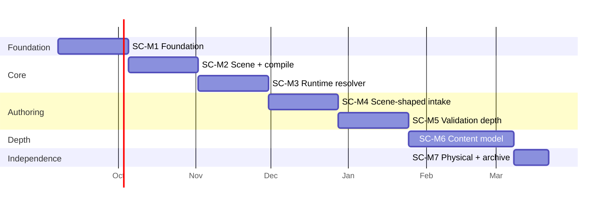

# Roadmap — Scene-Centric Backend

**Status:** Living document. Milestones SC-M1 and SC-M2 are firm; SC-M3 onward are
provisional and revised at each retro (§5).

**Track naming.** `SC-M*` deliberately does not continue the existing `M50–M54` sequence.
This is a parallel track, not the next item in the intake-pipeline series — the same
precedent `docs/DIALOGUE_CACHING_AND_CHARACTER_CASTING.md` sets for M54, which runs
outside the M50–M53 sequence.

**Cadence assumption.** One developer, two-week sprints, and roughly **60% of a sprint
available for planned work** — the rest absorbs interruptions, the existing `server/`, and
being wrong. A roadmap that assumes 100% is a roadmap that lies at the first retro.

---

## 1. Milestones

### SC-M1 — Foundation

*Sprints 1–2. The skeleton plus the two primitives everything gates on.*

| Contents | Feature |
|---|---|
| `api/{contracts,planning,runtime}` skeleton, no-import lint rule, CI wiring | F10 |
| Separate `planning.*` / `runtime.*` schemas and DB roles (rung 2 of §9.4) | F10 |
| Flag registry: definition, latching vs. tracking, set/read tracking | F1 |
| Condition grammar: expression type, evaluator, one shared implementation | F2 |
| D1/D2 fixes in the current `server/` | — |
| Spikes confirming the datastore assumptions | — |

**Exit criteria**
- A flag can be declared, and a condition referencing it evaluates against a fixture
  player state in both `planning/` and `runtime/` via `contracts/`.
- The no-import rule fails CI when violated (proven with a deliberate violation).
- D1 and D2 have regression tests that fail against the old behaviour.
- Every spike has a written answer in `spikes/`, including the ones that answer "no."

### SC-M2 — Scene model and compile

*Sprints 3–4. The unit exists and becomes an artifact.*

| Contents | Feature |
|---|---|
| Scene entity: location, time, weather, participants, items, dialogue references | F3 |
| Base + overlay composition; exclusive vs. additive resolution; priority precedence | F3 |
| Dialogue three-way keying and the specificity ladder | F7 |
| Compile step: content-addressed artifacts, manifest, atomic revision-pointer flip | F4 |
| Weather source decision (A6, resolved) and implementation: SC-305 (scene override field) + **SC-309, new** (`districts.weather` column, seed defaults, admin tooling) | F3 |

**Exit criteria**
- Two hand-authored scenes at one location — a base and a flag-gated overlay — compile to
  artifacts and resolve to different results as the flag flips.
- Equal-priority conflict on an exclusive property fails the compile.
- The revision pointer flips atomically and rolls back by flipping it again.
- A personality pool shared by two characters resolves correctly for both.

### SC-M3 — Runtime resolver

*Sprints 5–6. The slice is playable.*

| Contents | Feature |
|---|---|
| Player state: flags, current resolution, pinned cast, progress | F6 |
| Resolver: revision-scoped artifact lookup, condition evaluation, effect application | F5 |
| Choice-reachability validation before effects (new-backend equivalent of D2) | F5 |
| Scene pinning decision implemented (open question #3) | F3 |
| Serving benchmark baseline (prerequisite gap) | F5 |

**Exit criteria**
- A hand-authored scene slice is playable end to end in the existing client; the intake-authored slice is the SC-M4 exit criterion.
- A player session pins to a revision and is unaffected by a subsequent pointer flip.
- An unreachable choice submission is rejected with no effect applied.
- p50/p95 recorded for scene resolution and artifact fetch.

### SC-M4 — Scene-shaped intake

*Sprints 7–8. Writers can author the slice instead of hand-writing it.*

| Contents | Feature |
|---|---|
| Scene-shaped plan deltas: one description yields scene + participants + dialogue + flags | F8 |
| Tier-1 shape checks, per-tier required fields, live in the review step | F9 |
| Tier-2 reference checks against canon and within-plan | F9 |
| Approval granularity decision (open question #5) | F8 |

**Exit criteria**
- A writer describes a situation in natural language and the resulting plan, once
  approved, compiles and serves without hand-editing YAML.
- Shape and reference errors surface **before** approval, not at stage time.
- A plan referencing a nonexistent location cannot be approved.

### SC-M5 — Validation depth

*Sprints 9–10. The auto-check becomes genuinely useful.*

| Contents | Feature |
|---|---|
| `entity_edges` projection from entity payloads (note: some kinds like `located_in` require hand-authored mappings, per SC-S1) | S1 |
| Tier-3 anti-joins: orphan flags, dead ends, unreachable scenes, unreferenced items | S1 |
| Recursive-CTE reachability from game start | S1 |
| `pg_trgm` alias/duplicate detection | S10 |
| Hint engine over tier-3 results | S2 |
| Knowledge ledger shape + deterministic TB-cost linter (S14/S16 groundwork) — spike SC-S8; stories SC-1001 (ledger type), SC-1006 (TB linter, ships without spike and independent of SC-S10) | S14, S16 |
| Inventory ledger shape spike SC-S9 (feeds SC-M6) | S15 |

**Exit criteria**
- Tier-3 runs in CI and fails the build on a dead-end flag.
- The four anti-joins find at least one real problem in existing content, or the
  projection is demonstrated correct against a fixture that contains one.
- Reachability query has a recorded `EXPLAIN ANALYZE`.

### SC-M6 — Content model depth

*Sprints 11–13. The things that make content feel authored rather than structural.*

| Contents | Feature |
|---|---|
| Activity: 4-verb catalog, role-slot binding, `completion.type='none'` only | S4 |
| Asset look/expression model, mob pool, explicit signalled fallback chain | S5 |
| `asset_fallback` consumer — compile-time coverage report (prerequisite gap) | S5 |
| Character tier enforcement against asset requirements | S6 |
| Relationship stats and threshold→flag emission | S3 |
| Metagame checker (S14) + inventory checker (S15) + (time-vs-prose LLM assist (S16) only if SC-S10 records blocking-viable) — stories SC-1002–SC-1005; SC-1007–SC-1008 begin only after SC-S10 answer recorded (do not commit to review/CI until then) | S14, S15, S16 |

**Exit criteria**
- A mob pool serves several characters with no per-character asset rows.
- A named character missing its base look fails the compile; a missing optional
  expression warns and degrades along the documented chain.
- A stat crossing a threshold sets a flag as an event, and gating still reads only flags.

### SC-M7 — Physical independence & legacy archive

*After SC-M6. The new backend runs on its own databases; the old `server/` path gets a final run, then is archived and deleted.*

| Contents | Feature |
|---|---|
| `postgres-planning` + `postgres-runtime` services, same instance (rung 3 of `plan-graph-in-postgres.md` §9.4); `db/planning/migrations/` + `db/runtime/migrations/` with independent sequences, no `migration-targets.json` | F10 |
| New DBs boot with only `PLANNING_DATABASE_URL` / `RUNTIME_DATABASE_URL` (no `DATABASE_URL` fallback); legacy `las_flores` / `las_flores_analytics` untouched | F10 |
| Legacy freeze: old OLTP/OLAP set read-only; final `server/` run extracts reusable functions/ideas into `api/` (port log, not data) | SC-E9 |
| Archive + delete: versioned `pg_dump` of both legacy DBs stored alongside the repo tag, then compose services/volumes and `server/src/database/migrations/` removed | SC-E9 |

**Trigger (when this fires):** SC-M3 slice is green on rung 2 **and** SC-M6 exit criteria are met — i.e. the new backend no longer needs anything from the legacy schema. Do not start SC-M7 early to "avoid pollution": separation is the point, so new work lands in the new DBs from SC-E11 onward and legacy stays frozen.

**Exit criteria**
- `api/planning` migrates and serves from `postgres-planning` alone; `api/runtime` from `postgres-runtime` alone (proven by booting each with only its own URL set).
- SC-106 negative test passes against the physical hosts (runtime role cannot even connect to the planning DB — stronger than the rung-2 schema-USAGE denial).
- Legacy `server/` suite runs green one final time against a frozen snapshot, the extraction log (functions/ideas ported) is recorded, dumps are stored, and the old services/volumes/migration folder are deleted.
- No code path references `postgres-oltp` / `postgres-olap` or `server/src/database/migrations/`, and the `server/src/database/migrate.ts` shim is removed alongside them.

---

## 2. Timeline shape

Dates are **shape, not commitment.** SC-M1 and SC-M2 are planned in detail; anything past
SC-M3 is an ordering claim with a duration guess attached.

## 3. What comes after SC-M6

Unordered, unscheduled, revisited when SC-M6 closes: missions (S7), casting by
description (S9), lazy asset generation (S11), interactive activity and
`activity_sets_flag` (S12), and the decision on importing existing YAML content (S13).
Items (S8) and its inventory-ledger checker (S15) now have a scheduled path in SC-M5/SC-M6
(SC-E10); if SC-M6 slips they fall back here. Knowledge (S14) and time-vs-prose (S16)
likewise have a path, but any checker gated on a "no" spike answer returns here for
re-planning rather than being quietly re-attempted.

## 4. Retirement of the old path

Retirement is driven by the coexistence rules in `proposal.md` §7 — vertical slices, one
owner of canon at every moment, a one-way old→new import and never a write-back.

| Old component | Kill condition |
|---|---|
| Old dialogue serving path | SC-M3 exit criteria met **and** all shipped content compiled into the new artifact form |
| `FILL_TARGETS` entity-shaped intake | SC-M4 exit criteria met **and** no plan authored through it for one full sprint |
| Three-registry portrait resolution | SC-M6 exit criteria met **and** the coverage report shows zero silent fallbacks |
| `latency_probe.ts` as ingestion harness | already owned by M54; not this track's concern |

Nothing is deleted before its kill condition is written down and met. A component whose
kill condition slips twice gets re-examined at retro — the parallel-system failure mode is
both paths living forever, and slipping kill conditions is its earliest symptom.

**Legacy databases (SC-M7):** cutover to `postgres-planning` / `postgres-runtime` happens
when SC-M6 exit is met (new traffic and writers use only the new URLs). Legacy OLTP/OLAP
pair stays untouched and bootable during a rollback window (duration and close condition set at the SC-M6 retro, e.g. one sprint or a successful rollback drill) so the old generation can be
reinstated if needed. Only after the window: freeze (SC-905), final extraction (SC-906),
archive (SC-907), delete (SC-908). New work never lands in legacy.

## 5. The retro contract

This is what keeps the roadmap honest rather than decorative.

**Every sprint retro updates, in this order:**

1. **`sprint-NN.md`** — actual vs. planned, and one sentence per item that did not land
   saying why.
2. **`features.md`** — any feature that moved between primary and secondary, and any new
   prerequisite gap discovered. Gaps are the most common finding.
3. **This document** — the milestone the sprint belonged to (contents and exit criteria),
   and the *next* milestone if the sprint changed what is believed about it.
4. **`backlog.md`** — re-order, split, or delete. A story untouched across three retros
   is deleted, not carried.
5. **`sprint-NN+1.md`** — promoted from provisional to firm, with the spike answers folded
   in.

**Rules that make the update real:**

- **Only one sprint is firm at a time.** The next sprint is provisional until its
  predecessor's retro. Two firm sprints is a forecast pretending to be a plan.
- **A spike that answers "no" is a success.** It gets written up in `spikes/` and the
  affected feature is re-planned, not quietly re-attempted.
- **Exit criteria are not renegotiated mid-milestone.** They can be *changed at retro*
  with the reason recorded. Moving them to match what happened is how a roadmap stops
  meaning anything.
- **Estimates are recorded and compared, not defended.** The point of tracking planned vs.
  actual is calibration; a solo dev with no calibration data cannot plan a sixth sprint.
