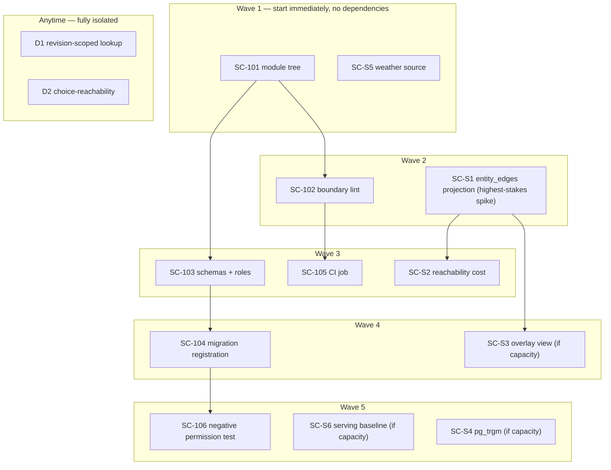

# Sprint 01 — Ticket & Spike Detail

One folder per ticket/spike. Each `README.md` has: context, dependencies, refined
acceptance criteria (checked against the actual repo — workspaces, CI, migration runner,
connection pooling), and a **Prompt to execute** section at the end, ready to hand to a
builder/dev.

See `../sprint-01.md` for the sprint-level narrative (goal, capacity, cut order, DoD,
retro checklist) — this folder is the detail layer underneath it.

## Recommended execution order

Not document order — dependency order. `SC-S1` gates `SC-S2` and `SC-S3` directly, and
gates `SC-701`/the whole SC-M5 design indirectly, so it runs first among the spikes. The
setup tickets (`SC-101` → `SC-103`/`104`/`105`/`106`) have their own internal chain but
don't block or get blocked by the spikes.

**Why this order, not the doc's listed order:**

1. **`SC-S5` runs on day one**, not mid-list. It's a research/decision spike with zero
   code dependency, it's on the "do not cut" list, and it's one of only three items that
   define sprint success (`../sprint-01.md` §4). There's no reason to wait on it.
2. **`SC-S1` runs before anything else spike-related.** It's the highest-stakes item in
   the sprint — `SC-S2` and `SC-S3` both consume its output table, and a bad answer
   ("required contorting existing payloads") needs to surface while there's still time
   to re-plan `SC-701`, not on the last day.
3. **`SC-S4` and `SC-S6` are fully independent** of the `SC-S1` chain and of the setup
   tickets — they can slot in wherever capacity allows, and are correctly last on the
   cut-priority list (`../sprint-01.md` §5) since they feed milestones several sprints
   out.
4. **`D1`/`D2` are isolated `server/` bugfixes** with no dependency on the new `api/`
   tree or any spike — schedule them wherever they fit without blocking the rest.

## Index

| Folder | Item | Size/box | Depends on |
|---|---|---|---|
| [SC-101-module-tree](SC-101-module-tree/) | Create the module tree | S | — | ✅ Done |
| [SC-102-boundary-lint](SC-102-boundary-lint/) | Boundary lint rule | S | SC-101 | ✅ Done |
| [SC-103-schemas-and-roles](SC-103-schemas-and-roles/) | Schemas and roles | M | SC-101 | ✅ Done |
| [SC-104-migration-runner](SC-104-migration-runner/) | Migration runner registration | S (reclassified from M) | SC-103 | ✅ Done |
| [SC-105-ci-job](SC-105-ci-job/) | CI job | S | SC-101, SC-102 | ✅ Done |
| [SC-106-negative-permission-test](SC-106-negative-permission-test/) | Negative permission test | S | SC-103, SC-104 | ✅ Done |
| [SC-S1-entity-edges-projection](SC-S1-entity-edges-projection/) | Project `entity_edges` | 1 day | — |
| [SC-S2-reachability-cost](SC-S2-reachability-cost/) | Recursive-CTE reachability cost | 0.5 day | SC-S1 |
| [SC-S3-overlay-view](SC-S3-overlay-view/) | Overlay view ADD+MODIFY | 1 day | SC-S1 |
| [SC-S4-pg-trgm-alias-detection](SC-S4-pg-trgm-alias-detection/) | `pg_trgm` alias detection | 0.5 day | — |
| [SC-S5-weather-source](SC-S5-weather-source/) | Weather source decision | 0.5 day | — |
| [SC-S6-serving-baseline](SC-S6-serving-baseline/) | Serving baseline | 1 day | — |
| [D1-revision-scoped-chunk-lookup](D1-revision-scoped-chunk-lookup/) | Revision-scoped chunk lookup | M | — |
| [D2-choice-reachability-validation](D2-choice-reachability-validation/) | Choice-reachability validation | M | — |
