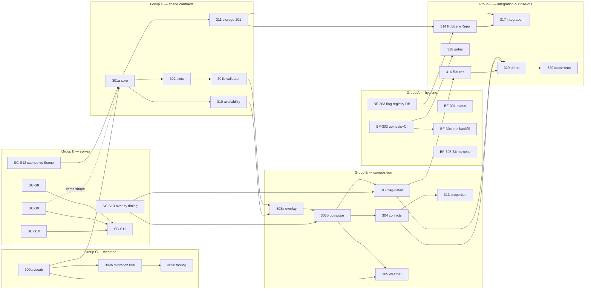

# Sprint 03 — Task plan (scene model & composition, plus hygiene and spikes)

Detail layer under [`../sprint-03.md`](../sprint-03.md), same role as `sprint-01/` was for
sprint 1. **Sprint 4 is deliberately not planned here** — it is chosen at the retro from
what this sprint actually finished and learned (`../roadmap.md` §5).

**Milestone:** SC-M2 (scene model + compile), first half · **Dates:** TBD

**Sprint goal.** The scene is a first-class authored object — contract, validation, storage,
and base + overlay composition with deterministic conflict detection — on top of a code base
whose "Done" rows are true again. Compile output (SC-E4) is *not* in this sprint.

## Size of the plan

| | Count |
|---|---|
| Significant tasks (S/M/L) | **32** — 5 bugfix/hygiene, 6 spikes, 3 weather, 5 scene contracts, 6 composition, 3 server/fixtures, 4 verification |
| Mechanical sub-tasks (`m-01`…`m-91`) | **91** — each lives under its parent task |
| Relative size (S=1, M=2, L=3) | 54 points: **P0 = 29**, P1 = 24, P2 = 1 |

No velocity data exists yet (Sprint 02's six tickets are the only calibration), so the plan
commits to **P0 only**; P1 is the forecast, P2 is the first cut. The retro should record
actual-vs-points per group so Sprint 4 is sized from data.

## Groups

| Group | File | Tasks | Points |
|---|---|---|---|
| A · Hygiene & bugfixes | [group-a-hygiene-bugfixes.md](group-a-hygiene-bugfixes.md) | BF-301 · BF-302 · BF-303 · BF-304 · BF-305 | 9 |
| B · Spikes | [group-b-spikes.md](group-b-spikes.md) | SC-S12 · SC-S13 · SC-S8 · SC-S9 · SC-S10 · SC-S11 | 6 |
| C · District weather ✅ | [group-c-district-weather.md](group-c-district-weather.md) | SC-309a · SC-309b · SC-309c (all merged) | 5 |
| D · Scene contracts & storage | [group-d-scene-contracts.md](group-d-scene-contracts.md) | SC-301a · SC-302 · SC-301b · SC-310 · SC-311 | 10 |
| E · Composition | [group-e-composition.md](group-e-composition.md) | SC-303a · SC-303b · SC-304 · SC-305 · SC-312 · SC-313 | 12 |
| F · Integration, fixtures & close-out | [group-f-integration-closeout.md](group-f-integration-closeout.md) | SC-314 · ~~SC-315~~ (deferred) · SC-316 · SC-317 · SC-318 · SC-319 · SC-320 | 10 |

## Priority

| P | Tasks | Meaning |
|---|---|---|
| **P0** (commit) | BF-301 · BF-302 · BF-303 · BF-304 · SC-S12 · SC-S13 · SC-309a · SC-309b · SC-301a · SC-302 · SC-301b · SC-310 · SC-303a · SC-303b · SC-304 · SC-319 · SC-320 | Sprint fails without them. Gives: true status, tested api code, scene contract, composition, conflict detection, demo evidence |
| **P1** (forecast) | BF-305 · SC-S8 · SC-S9 · SC-S11 · SC-309c · SC-311 · SC-305 · SC-312 · SC-313 · SC-314 · SC-316 · SC-317 · SC-318 | Expected to land; first to slip is whatever the spikes re-plan |
| **P2** (stretch) | SC-S10 | Nothing else depends on it |

**Cut order** if capacity runs short (earliest cut first): SC-S10 → SC-S11 → SC-309c →
SC-313 (keep the order-independence property only) → BF-305 → SC-S8/S9.
**Never cut:** BF-301–304, SC-S12, SC-S13, SC-304, SC-319.

## Findings that shaped this plan (verify, don't trust)

1. **Name collision.** `content/scenes/*` and the `scenes` table are *location backdrops*, not the situation-with-role-slots the proposal calls a scene → **SC-S12** gates the entity name and the importer.
2. **A contradiction in the docs.** SC-303 says overlays are applied at compile time; flag-gated overlays depend on per-player state that does not exist at compile → **SC-S13** decides variant enumeration vs. ordered conditional layers *before* composition is written.
3. **False Done rows.** SC-202's DB adapter throws; `api/planning` and `api/runtime` tests are no-ops that CI never runs → **Group A**.
4. **SC-304 pulled forward.** SC-303 defers the equal-priority conflict to it and the SC-M2 exit criterion needs the compile to fail on it.
5. **No new pools.** Adapters use `oltpPool`/`withOLTPTransaction` with `planning.*` names (AGENTS hard constraint).

## Dependency graph

## Execution order (waves)

| Wave | Start immediately / next | Why |
|---|---|---|
| 1 | BF-301, BF-302, BF-303, SC-S12, SC-S13, SC-309a, SC-S8, SC-S9 | No dependencies. Spikes S12/S13 go first because they gate D and E |
| 2 | BF-304, SC-309b, SC-301a, SC-S10 | After S12 + 309a |
| 3 | SC-302, SC-310, SC-311, SC-309c, SC-303a (after 301b), SC-301b | Contracts fan out |
| 4 | SC-303b, SC-305, SC-314, SC-316 | Needs S13 and the overlay contract |
| 5 | SC-304, SC-312, SC-313, BF-305, SC-S11 | Composition hardening (SC-315 importer deferred to the `db` package work) |
| 6 | SC-317, SC-318, SC-319 → SC-320 | Evidence and close-out |

Groups A, B and C are independent of each other, so three people (or sessions) can start in parallel.

## Definition of Done

- Every P0 task has its acceptance met **with evidence** (test name, run output, or write-up link) recorded in `EVIDENCE.md`.
- `npm run typecheck`, `lint` and `test` pass for all three api workspaces **in CI**, and the boundary proof test still passes.
- Server: `npm run lint --workspace=server`, `npm run build --workspace=server`, `jest tests/unit tests/smoke --no-cache --forceExit` green; migrations 097, 098 and 101 apply cleanly and are idempotent; if server code changed, container rebuilt and `docker exec las-flores-server wget -qO- http://localhost:3000/health` returns `{"success":true}`.
- Content: `npm run validate:content` green after SC-309c.
- Backlog/README rows reflect the evidence, not the intent (SC-320).
- **Out of scope** (do not pull in): SC-E4 compile/artifacts/revision pointer, SC-306/307/308 (personality pools, role-slot dialogue, specificity ladder), SC-E5 and later.

## Risks

| Risk | Mitigation |
|---|---|
| SC-S13 answers "enumerate variants" and invalidates the single-`ResolvedScene` shape | E2/E5 are blocked on it by design; D-group contracts do not depend on the resolved shape |
| SC-S12 says existing scenes are locations, shrinking SC-315 and changing `location` in SC-301a | Wave 1 spike; SC-301a waits for it |
| `ts-jest` cache corruption mimics real failures | Always confirm with `--no-cache` full run before debugging (AGENTS) |
| Three migrations (097, 098, 101) in one sprint collide with parallel work | One migration per owner; `withSchemaLock` in tests; numbers reserved here: 097 BF-303, 098 SC-309b, 101 SC-311 (099–100 were taken by the districts work, so 099 was skipped) |

## Spike Completion Status (2026-10-06)

**Group B (Spikes) Progress:** 6/6 written up; 4 complete, 2 awaiting LLM endpoint

| Spike | Status | Blocking? | Outstanding |
|---|---|---|---|
| SC-S12 | ✅ Done | No | Rename approved (planning.scene_defs / SceneDefRepository); backlog updated |
| SC-S13 | ✅ Done | No | Proposal.md §2.2 updated; SC-303 wording revised; conflict rule finalized |
| SC-S8 | ✅ Done | No | **Explicit-only registry confirmed** — cheap-model eval run 2026-10-06: 69% prec / 61% recall (not viable); no inference path. Changes SC-1001/1002/1003 |
| SC-S9 | ✅ Done | No | **Scene `items` = props-only confirmed**; no `item_ref` in SC-301; changes SC-301, SC-1004 |
| SC-S10 | ✅ Done | No | **Deterministic: time=tag confirmed**; TB cost on choices/gigs. **SC-1007 stays hint-only** (model eval run 2026-10-06: 75% prec / 50% recall on detection — below 85%/80% blocking threshold). Changes SC-301, SC-1006, SC-1007 |
| SC-S11 | ✅ Done | No | Harnesses committed under `server/scripts/spikes/` (4 files); reproducibility rule satisfied |

**All complete.** LLM evals run with real `poolside/laguna-m.1` via LiteLLM. Both S8 and S10 confirm: explicit-only knowledge ledger, hint-only time validation, no inference paths viable for blocking.

**Unblocking downstream:** SC-301, SC-311, SC-314, SC-315 can now proceed with stable spike inputs.

